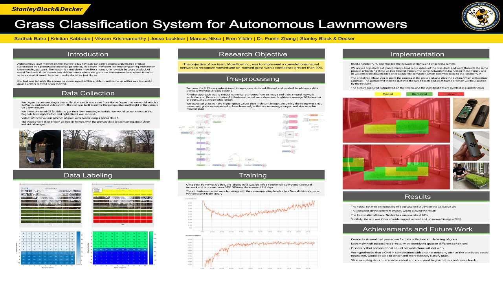

# Hello World!
We are Mow Mow Inc, a group of Georgia Tech seniors that worked together to create the basis for developing tools to distinguish mowed vs unmowed grass for an autonomous lawnmower.

We created tools to label images of the different types of grass we came across and build convolution neural network to trained said images and test the neural network to see how well it performs in the real world. 

Disclaimer: the group name was inspired ~~gracefully~~ by Mario Kart's Moo Moo Farm stage.

## Data Collection
This program consists of a tool to capture and label images according to its grass status:  
*Mowed, Unmowed, Unknown, Irrelevant*. 

The program consist of the following classes to work:

### dataCollection.py
Main Runner for data labeling tool to run it call *__python dataCollection.py__* and the GUI will load the images located on the Image folder located on the folder inside Data Collection.

This class contains all the logics behind each button actuation and backend of the labeling tool
# mainGUI.py
Class that generates all the necesary logic behind the GUI in the creation, configuration, and display of all the elements (buttons, progressbar, layout, etc)


## Neural Network

### mowmowCNN.py
Script used for training the network with training data created from the data collection porcess.  
*Utilizes TFLearn API to provide a neater and simpler way of coding.*

Network Structure:

```
               /------\          /------\          /------\          /------\          /------\
input -------> | CONV | -------> | POOL | -------> | CONV | -------> | CONV | -------> | POOL | -----\
               \------/          \------/          \------/          \------/          \------/      |
                                                                                                     |
      /---------\          /-----------------\          /---------\          /-----------------\     |
 /--- | DROPOUT | <------- | FULLY_CONNECTED | <------- | DROPOUT | <------- | FULLY_CONNECTED | <---/
 |    \---------/          \-----------------/          \---------/          \-----------------/
 |
 |     /-----------------\        /---------\        /-----------------\
 \---> | FULLY_CONNECTED | -----> | DROPOUT | -----> | FULLY_CONNECTED |  -----> output
       \-----------------/        \---------/        \-----------------/
```
### mowmowCNNEval.py
Class used to perform manual benchmarking on the accuracy of training checkpoints.
### mowmowCNNPredictor.py
Class used to for runtime. It takes a CSV file directory as input, then loads and runs all the images listed in the CSV through the network, compiling the predictions in an array.

## Demo

This Folder contains all the programs to run the demonstration. Requirements are that you need two computers: One running the NeuralNet.py which does all the predictions and the other one running the lawnmowerSim.py which does all the simulation, preferibly this latter one should run on a raspberry pi, however small modifications can be done to run this on a PC

Computer 1: __*python NeuralNet.py*__  
Computer 2: __*python lawnmowerSim.py #*__, where # is either 0 (to run on images already saved on the computer) or 1 (to run live by taking pictures on the spot)

### CNNsftp.py
Class used to establish a SSH connection between computers
### NeuralNet.py
Class to run NeuralNetork given some weights of a trained dataset and image provided by another computer
### easterEgg.py
This is an easterEgg :)
### fetchImageEgg.py
This script connects to a GoPro Camera and saves the image to a specified directory.

*This runs on python3 and accepts an argument when call which is used to save a picture*
### frameOverlayer.py
Class that uses a given image and projects and overlay of a specified color depending on the classification of the frame of the image
### lawnmowerSim.py
This class is a lawnmower simulation. It uses a Finite State Machine to simulate a pipeline that at each state a task is perfomed. It starts with no actions until a trigger is flagged and begins the run. Begins by taking a pictures and sends it to a neural network, where the neural network will obtain the predictions and distribute it to its proper states (Mowed, Unmowed, Irrelevant, Unknown) in which those state will gather some parameters that will later be executed by the last state.
### mowmowCNNPredictor.py
Dependency class used on the NeuralNet to come with all the predictions

## Misc Codes

### Camera.py
A Camera library made to connect to a USB camera
### resizeImg.py
Script that takes an image and resize it to a specified size
### videoSlicing.py
Script that takes a video and slices each frame and saves it to a specified directory

## Project Poster

